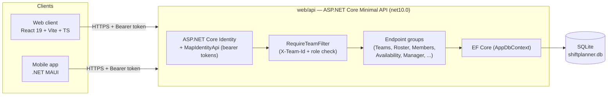
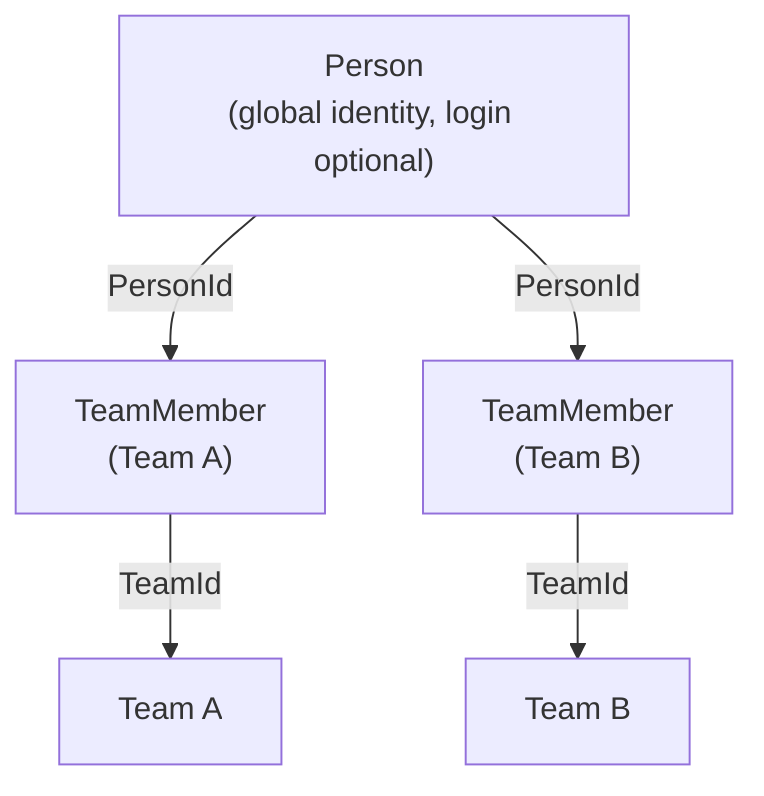
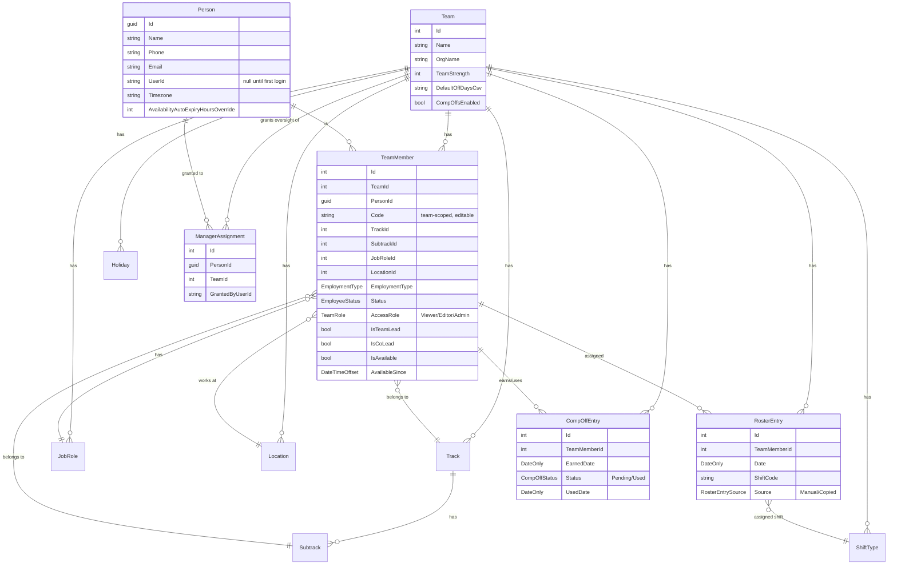
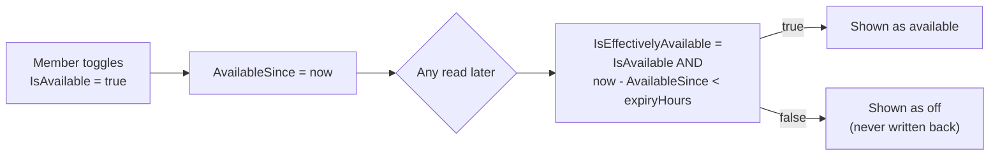

# ShiftPlanner — Technical Design Document

## 1. Product vision

ShiftPlanner is a multi-tenant shift-roster product. A single **Team** is the
tenant boundary: a company, department, or store signs up, creates a team,
and everything they do — roster, team members, master data, reports — is
scoped to that team. One backend (`web/api`) serves two thin client
interfaces that share the exact same REST contract:

- **Web** (`web/client`) — the full-featured admin/manager surface.
- **Mobile** (`mobile/`) — a .NET MAUI app for day-to-day roster viewing and
  lighter admin tasks, currently targeting Android and Windows.

A third app, **Desktop** (`desktop/`), was an earlier single-tenant
WPF/local-SQLite prototype. It is now frozen — not maintained going forward —
and is not part of the multi-tenant product.

The intent is for the same backend to work both as a self-hosted solution
(an individual team points their own client at their own server) and,
longer-term, as a wrapped SaaS product for organizations — the tenant model
already supports either without client changes.

## 2. High-level architecture

Both clients call the same base URL and the same JSON contract. The only
difference between "self-hosted for one org" and "SaaS for many orgs" is how
many `Team` rows exist in the database — the code path is identical.

## 3. Tech stack

| Layer | Technology |
|---|---|
| Backend | ASP.NET Core Minimal API, .NET 10 |
| ORM / DB | EF Core 10 + SQLite (`AppDbContext`, schema via `EnsureCreated` — no migrations yet) |
| Auth | ASP.NET Core Identity (`IdentityUser`) + `MapIdentityApi` bearer tokens; custom phone+password login endpoint |
| Excel/CSV | ClosedXML (export/import) |
| Backend tests | xUnit (`web/api.Tests`) |
| Web client | React 19, TypeScript, Vite 8, React Router 7, TanStack React Query 5 |
| Mobile | .NET MAUI (net10.0-android, net10.0-windows), CommunityToolkit.Mvvm, Shell navigation |
| Desktop (frozen) | WPF, local SQLite, no longer maintained |

## 4. Multi-tenancy model

`Team` is the tenant boundary. Every tenant-scoped table carries a
`TeamId` foreign key, and every tenant-scoped endpoint requires an
`X-Team-Id` request header naming which team the call is for.

- **`Person`** is a human being independent of any team — name, phone,
  email, optional `UserId` (set once they actually sign in), timezone, and
  availability auto-expiry override.
- **`TeamMember`** is one row per person per team. It merges what used to be
  two separate concepts — "has login access to this team" and "is on this
  team's roster" — into a single record, because in practice they were
  almost always the same people. A person on three teams has three
  `TeamMember` rows, one `Person` row.

Every write to a `TeamMember`'s `AccessRole` (`Viewer` / `Editor` / `Admin`)
governs what that person can do **on that specific team** — access is not
global.

### Request-scoping (`RequireTeamFilter`)

`Services/RequireTeamFilter.cs` is an `IEndpointFilter` applied to every
tenant-scoped endpoint via three extension methods:

- `.RequireTeamMember()` — any active role (Viewer+), for reads.
- `.RequireTeamEditor()` — Editor or Admin, for writes.
- `.RequireTeamAdmin()` — Admin only, for team/member management.

On every request it:

1. Resolves the caller's `UserId` from the bearer token.
2. Runs `PendingInviteClaimer.ClaimAsync` — if an admin already added this
   person's email/phone to a team *before* they ever signed up, this is
   where that `Person.UserId` gets claimed on first login.
3. Reads `X-Team-Id`, looks up the caller's `TeamMember` row on that team,
   and checks the minimum role.
4. Stashes a `TeamContext` (`UserId`, `Email`, `TeamId`, `Role`) on
   `HttpContext.Items` — every endpoint reads `TeamId` from here, **never**
   from a client-supplied body field, so a request can never touch a team
   the caller isn't a member of.

Two endpoint groups are deliberately **not** team-scoped:
`GET /api/teams/mine` (list of the caller's own teams — that's how you find
out which `X-Team-Id` values you're even allowed to use) and the
`/api/manager/*` group (cross-team oversight, see §6.5).

## 5. Data model

### Key entities

- **`Team`** — tenant root. Carries free-form settings (`OrgName`,
  `TeamStrength`, `ShiftsCovered`) plus `DefaultOffDaysCsv` (which weekdays
  count as "everyone's default off day" for comp-off purposes) and
  `CompOffsEnabled`.
- **`Person`** / **`TeamMember`** — see §4.
- **`Track`** / **`Subtrack`** — a team's own grouping of roles (e.g.
  "Front Desk" → "Morning" / "Evening" subtracks). Used to group the roster
  grid and, previously, as the roster's primary grouping key.
- **`JobRole`** / **`Location`** — per-team master lists (seeded with common
  starter values), replacing what used to be free-text fields on the
  employee record so they don't drift into typo variants.
- **`ShiftType`** — a team's named shifts (code, display name, start/end
  time, color, overnight flag).
- **`RosterEntry`** — one team member's shift on one date. `Source`
  distinguishes a manually-set entry from one produced by Copy Forward.
- **`CompOffEntry`** — a ledger row, not a flag on `RosterEntry`, so a
  comp-off's earn date and use date can be tracked independently and the
  utilization report can answer "who has pending comp-offs" without
  re-deriving it from roster history.
- **`Holiday`** — per-team holiday calendar (used by reports/roster).
- **`ManagerAssignment`** — deliberately separate from `TeamMember`/
  `AccessRole`. Grants a `Person` **read-only** cross-team oversight of a
  team without giving them a roster-edit role on it. See §6.5.

## 6. Feature deep-dives

### 6.1 Roster & shift assignment

`GET /api/roster?year=&month=` returns the whole team's month in one
payload: `TeamMembers` (with nested `Person`/`Track` — **raw EF entities**,
not flat DTOs, unlike most other endpoints), `Entries`, and `ShiftTypes`.
Both clients derive their day/month views from this single payload rather
than making per-day requests.

`PUT /api/roster/entry` assigns, changes, or clears (`ShiftCode: null`) one
team member's shift on one date. Requires Editor+. Every upsert calls
`CompOffAutoEarn.SyncAsync` (shared with Copy Forward), which keeps the
comp-off ledger in sync with that one entry: if `CompOffsEnabled` is on and
the date is a team default-off day and the assigned shift is a work shift
(`ShiftType.IsWorkShift`), a `Pending` `CompOffEntry` is created; if the
entry is later cleared or changed to a non-work code, the still-unused
`Pending` entry is removed again (an already-`Used` comp-off is left
alone — it's been spent).

`POST /api/roster/copy-forward` copies a source month onto a target month,
either by weekday pattern or exact date, skipping inactive team members and
flagging anything that needs a human look (holiday collision, existing
leave, etc.) rather than silently overwriting it.

### 6.2 Comp-off ledger

Earned automatically (see above) or reviewable via `GET /api/comp-offs`.
`POST /{id}/use` consumes a pending comp-off against a specific make-up
date; `POST /{id}/unuse` reverses that. Utilization reports read this ledger
directly rather than re-deriving it from the roster.

### 6.3 Live Availability

Independent of the planned roster entirely — a lightweight "I'm free right
now" self-toggle, not a schedule. `TeamMember.IsAvailable` /
`AvailableSince` are the raw fields, but they're never trusted directly:
every read goes through `AvailabilityService.IsEffectivelyAvailable`, which
treats the flag as expired once `now - AvailableSince` exceeds the
member's effective auto-expiry window.

The expiry window itself: `Person.AvailabilityAutoExpiryHoursOverride` if
set, else a timezone-based default — 9h for `Asia/Kolkata`/`Asia/Calcutta`
(the legacy IANA alias some browsers still resolve to), 8h everywhere else.

### 6.4 Master data

Tracks/Subtracks, Job Roles, Locations, Shift Types, and Holidays are all
per-team CRUD lists, each with its own endpoint group, each seeded with
sensible starter values on team creation (`Data/MasterDataSeed.cs`) so a new
team isn't starting from a blank slate.

### 6.5 Manager oversight

A separate, deliberately narrow permission: `ManagerAssignment` links a
`Person` to a `Team` they are **not** a `TeamMember` of, granting read-only
visibility into that team's Live Availability dashboard — nothing else. It
exists so, e.g., a regional manager can see who's free across several
teams they don't otherwise have edit rights on.

- `POST /api/teams/current/managers` (Admin-only, current team) — grant.
  The search endpoint (`GET .../managers/search?phone=`) is scoped to
  people the acting admin already manages somewhere else, not a global
  directory.
- `DELETE /api/teams/current/managers/{id}` — revoke.
- `GET /api/manager/teams` / `GET /api/manager/availability` — **not**
  team-scoped (no `X-Team-Id`); these read every team the caller has a
  `ManagerAssignment` for and return a combined dashboard.

### 6.6 Import / Export

`GET /api/export/excel` and `/csv` produce the month's roster as a
downloadable file (ClosedXML). `POST /api/import/employees` bulk-loads team
members from a spreadsheet.

## 7. API surface (by group)

| Group | Base route | Notes |
|---|---|---|
| Identity | `/api/register`, `/api/login`, `/api/register-account`, `/api/login-phone` | `MapIdentityApi` (email+password) plus a custom phone+password path |
| Teams | `/api/teams`, `/api/teams/mine` | Create team, list caller's teams — `mine` is not team-scoped |
| Team Members | `/api/teams/current/members/*` | CRUD, `/me`, `/next-code`, `/{id}/role`, `/{id}/lead`, `/{id}/co-lead`, `/unassigned-candidates`, `/assign-existing` |
| Team Settings | `/api/teams/current/settings` | Org name, strength, off days, comp-off toggle |
| Roster | `/api/roster`, `/api/roster/entry`, `/api/roster/copy-forward` | See §6.1 |
| Master data | `/api/tracks`, `/api/subtracks`, `/api/job-roles`, `/api/locations`, `/api/shift-types`, `/api/holidays` | Per-team CRUD |
| Comp-offs | `/api/comp-offs`, `/{id}/use`, `/{id}/unuse` | See §6.2 |
| Reports | `/api/reports/utilization` | Date-ranged utilization + comp-off summary |
| Availability | `/api/teams/current/availability`, `/api/teams/current/members/me/availability` | See §6.3 |
| Profile | `/api/me/profile` | Timezone, auto-expiry override |
| Manager | `/api/teams/current/managers*`, `/api/manager/teams`, `/api/manager/availability` | See §6.5 — the `/api/manager/*` pair is not team-scoped |
| Export/Import | `/api/export/excel`, `/api/export/csv`, `/api/import/employees` | See §6.6 |

All routes above except Identity and `/mine` require the `X-Team-Id` header
and a matching `TeamMember` row (see §4); `/api/manager/*` requires only
authentication.

## 8. Web client architecture

React 19 + TypeScript + Vite, React Router 7 for navigation, TanStack React
Query 5 for all server-state fetching/caching/polling (no separate global
store — query cache is the source of truth for server data).

Pages (`web/client/src/pages`): `Login`, `CreateTeam`, `SelectTeam`,
`Roster`, `TeamMembers`, `Settings`, `Reports`, `Live`, `ManagerDashboard`,
`Profile`. Shared components include `RosterTable`,
`TeamMemberFormModal`, `ShiftPopup`, `CopyMonthModal`, `ImportExportPanel`,
`AvailabilityList`, `TeamSwitcher`.

Visual system ("Ledger" direction, applied across the whole app): navy
sidebar, report-blue accent, brass secondary accent reserved for "Lead"
badges, semantic success/warning/critical tokens kept separate from the
brand accent, slab-serif headings.

## 9. Mobile app architecture

.NET MAUI, `net10.0-android` and `net10.0-windows10.0.19041.0` targets
(iOS/MacCatalyst scaffolded but commented out). MVVM via
`CommunityToolkit.Mvvm` (`[ObservableProperty]`, `[RelayCommand]`), Shell
navigation with a bottom `TabBar`.

- **`Services/ApiClient.cs`** — typed HTTP wrapper; reads the base URL
  (`AppSettingsStore.ApiBaseUrl`) and bearer token
  (`SecureTokenStore`) fresh on every call, so changing the server address
  in Settings or logging out takes effect immediately without an app
  restart.
- **`Services/AppSettingsStore.cs`** — non-secret settings via MAUI
  `Preferences` (server address, current team, cached member code).
- **Tabs**: `Roster` (day-by-day view of the same `/api/roster` payload the
  Web grid uses), `Team Members` (merged directory + add/edit form —
  mirrors the Web `TeamMembers` page), `Settings` (Tracks/Subtracks +
  Shift Types CRUD), `Profile` (server address, member code fallback,
  sign out).
- **Not yet ported to Mobile**: Live Availability, Manager Dashboard, and
  the Profile timezone/auto-expiry controls exist on Web only so far —
  planned as a later pass, not part of the initial backend-sync work.

`GET /api/roster` is the one endpoint that returns raw EF entities instead
of flat DTOs (see §6.1) — Mobile's `RosterResponse` model is shaped to match
that specifically, distinct from the flat `TeamMember` model used
everywhere else.

## 10. Desktop app (frozen)

`desktop/` is a WPF app against a local SQLite file, predating the
multi-tenant backend. It is **not** being upgraded further — Web and Mobile
are the two active client interfaces going forward.

## 11. Deployment & environments

- **Backend**: self-hosted ASP.NET Core app; SQLite file, schema created via
  `EnsureCreated` (no EF migrations yet — a real schema change today means
  deleting the dev `.db` file and reseeding, which is a known gap before any
  production rollout).
- **Web**: static build served by the same origin as the API in production
  (`app.MapFallbackToFile("index.html")`), or any static host pointed at the
  API's URL.
- **Mobile**: side-loaded / store-distributed APK; the server address is
  user-entered in Settings/Login, since this is a self-hosted tool rather
  than a fixed SaaS endpoint. For local development against an Android
  emulator, use `10.0.2.2` as the host-loopback alias instead of
  `localhost`.

## 12. Testing

`web/api.Tests` (xUnit) covers `AvailabilityService` (including the
`Asia/Kolkata` / `Asia/Calcutta` alias case), the Availability endpoints,
and the Manager grant/revoke/dashboard endpoints end-to-end against an
in-memory test host. Mobile and Web client currently rely on manual
end-to-end verification (browser walkthroughs, emulator runs) rather than
an automated UI test suite.

## 13. Known limitations / near-term follow-ups

- No EF Core migrations — schema evolution currently requires a destructive
  dev-db reset.
- Mobile lacks Live Availability, Manager Dashboard, and the
  timezone/auto-expiry parts of Profile (Web-only today).
- Desktop is frozen and increasingly out of sync with the multi-tenant
  model; not recommended for new use.
- Single-currency/locale assumptions throughout (no i18n layer yet).
- No push notifications on Mobile (availability/roster changes require
  opening the app).
- `Holiday` has a full backend CRUD endpoint (`/api/holidays`) but no Web
  or Mobile UI wired up to it yet.
