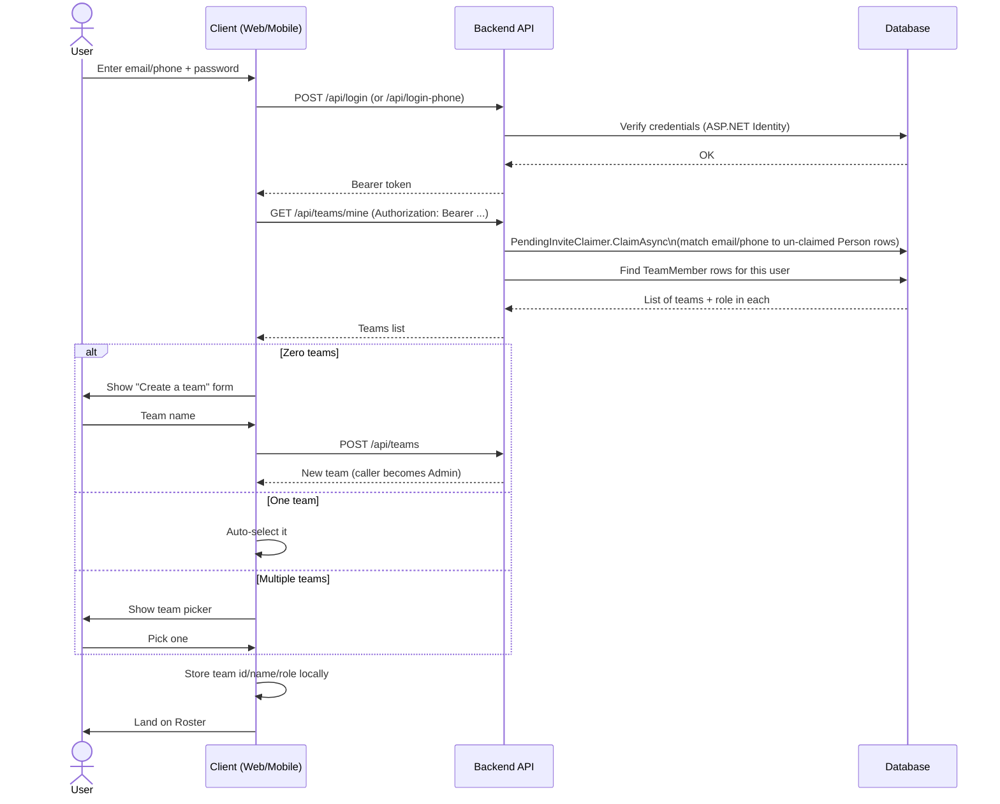
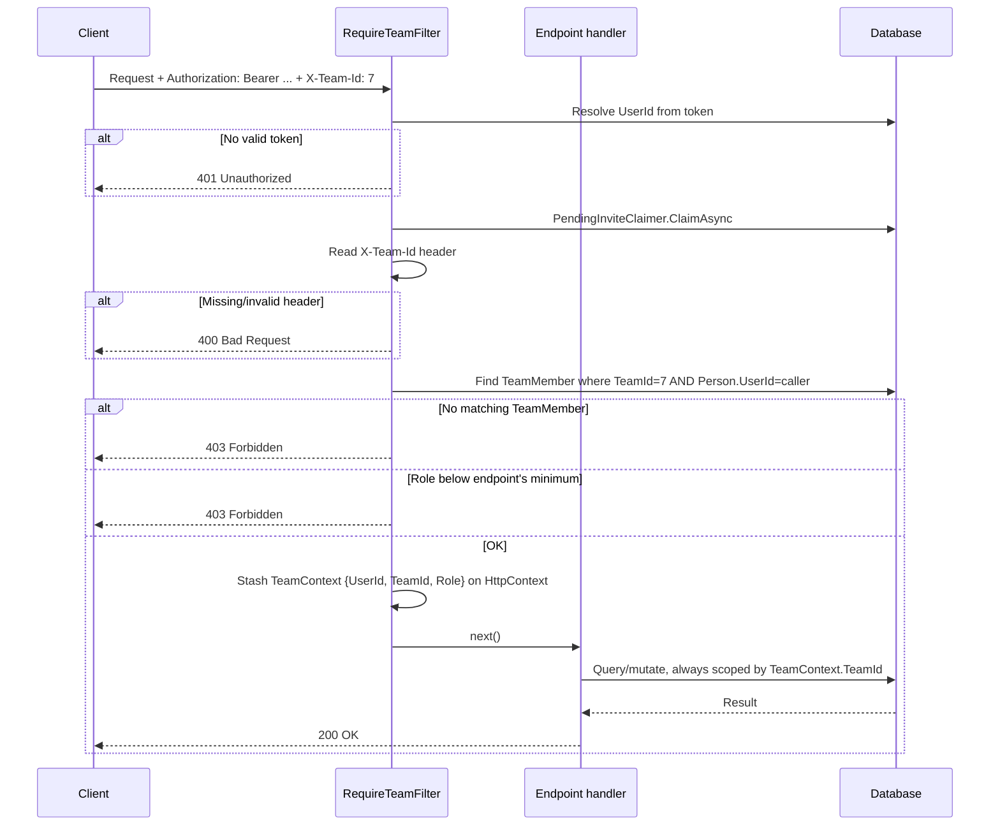
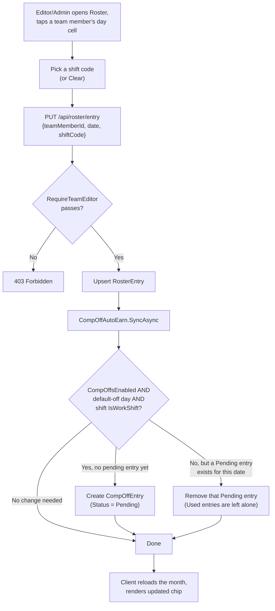
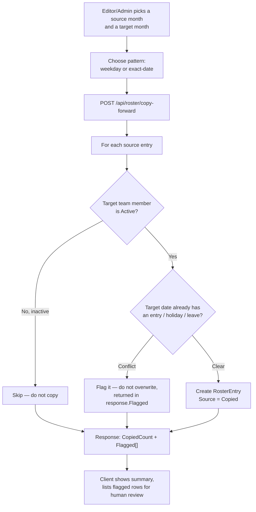
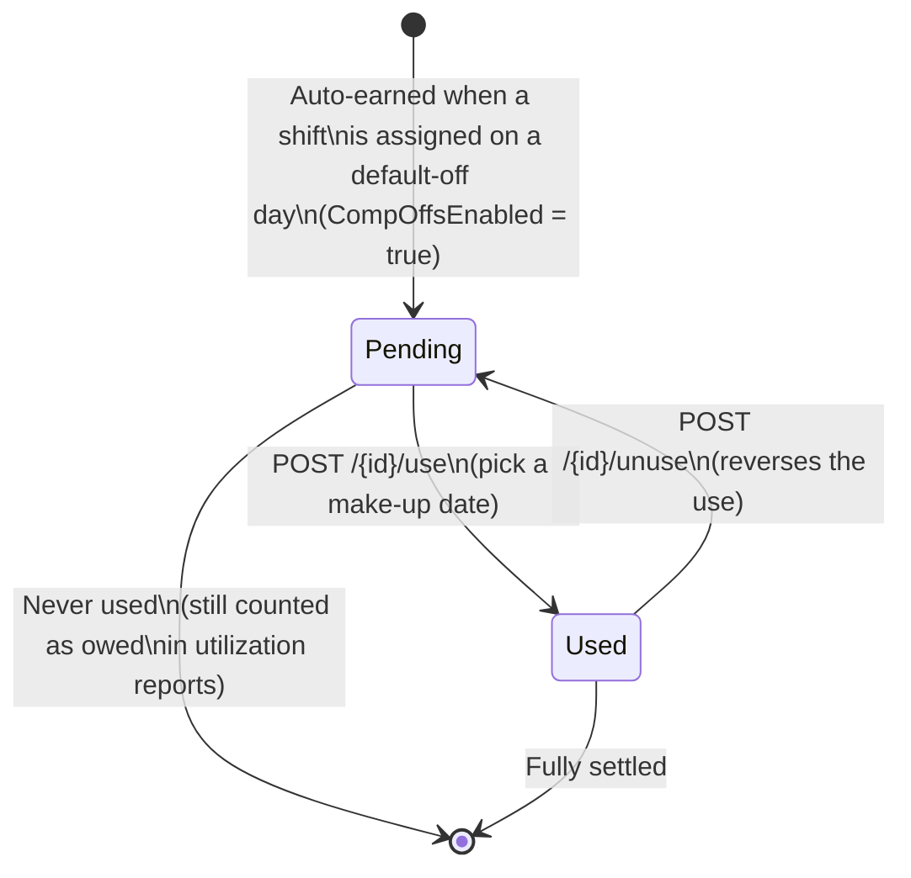
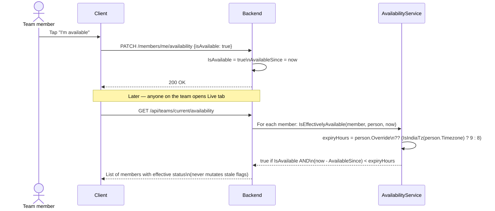
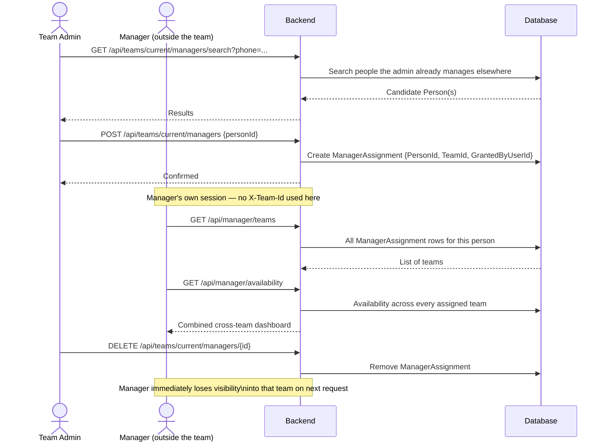
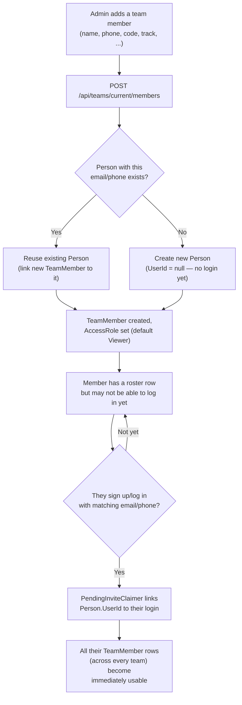

# ShiftPlanner — Workflow Diagrams

Companion to the [Technical Design Document](TECHNICAL_DESIGN.md). These
diagrams walk through the system's key request flows and feature lifecycles.

## 1. Sign-up, login, and team selection

**Key point:** `PendingInviteClaimer` is what lets an admin add someone by
email/phone *before* that person has ever signed up — the very first time
they log in with a matching email or phone, their pre-created `Person` row
gets linked to their new login, and their `TeamMember` rows (and any
`ManagerAssignment` rows) just appear.

## 2. Every tenant-scoped request

Every tenant-scoped read or write in the API goes through this exact
sequence — a client can never smuggle in a different `TeamId` inside a
request body, because handlers only ever read `TeamId` from the
server-resolved `TeamContext`, never from client input.

## 3. Assigning a shift

## 4. Copy Forward

## 5. Comp-off lifecycle

## 6. Live Availability

The expiry is computed on every read, never written back — so a member who
forgets to toggle off simply stops showing as available once their window
elapses, with no cleanup job required.

## 7. Manager oversight — grant and cross-team dashboard

## 8. New team member onboarding

